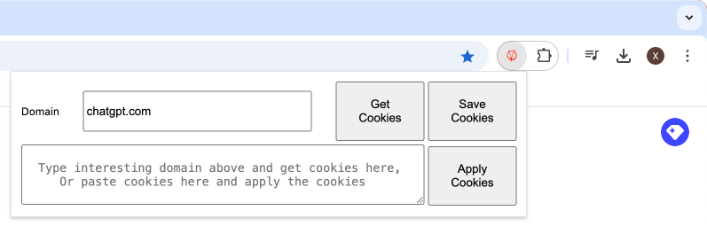
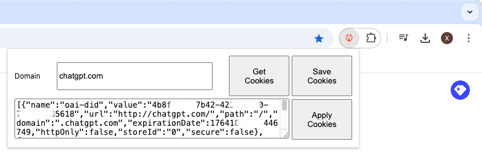

## impostor: A Google Chrome extension to impersonate others.
* I want my friend to use my ChatGPT account but I do not have a password (I use OAuth2) to share, so I made this extension to share my openai account's access tokens in the cookies.  
* Mechanism
  1. Get cookies that matche a specified domain (chatgpt.com).
  2. Export cookies as text or save it as json file locally.
  3. Import cookies from text on another machine.
* Usage
  * Open the extension in webpage "https://chatgpt.com/", where I have logged into my ChatGPT account.
  </img>
  * Then click the button "Get Cookies" related to "chatgpt.com" 
  </img>
  * Email Cookies in plain text to my friend.
  * Ask my friend to open the extension in his machine, copy and apply the "Cookies" then he can open "https://chatgpt.com/" without login. 
### What is new? [For yt-dlp user]
* Got the error "ERROR: [youtube] xxxxxxx: Sign in to confirm you’re not a bot. Use --cookies-from-browser or --cookies"? It is because you need cookies for domain ".youtube.com". (DO NOT omit the first dot)
  ```shell
  yt-dlp --cookies youtube.com.txt https://www.youtube.com/watch?v=UjpbQ1OWMPE
  ```
  * Put ".youtube.com" in the domain box of our extension.
  * Click "Save Cookies" button
  * Convert the json format to Netscape format
  ```
  import pandas as pd

  df = pd.read_json('youtube.com.json', dtype={'expirationDate':int}) 
  df['True'] = 'TRUE'
  df['_secure'] = df.apply(lambda x: 'TRUE' if x.secure else 'FALSE', axis=1) 
  df = df[['domain', 'True', 'path', '_secure', 'expirationDate', 'name', 'value']]

  txt  = '''# Netscape HTTP Cookie File
  # yt-dlp --cookies youtube.com.txt https://www.youtube.com/watch?v=UjpbQ1OWMPE

  ''' + df.to_csv(header=False, index=False, sep='\t')
  with open('youtube.com.txt', 'w') as fw: 
      fw.write(txt)
      print(txt)
  ```
* Result
  ```txt
  # Netscape HTTP Cookie File
  # yt-dlp --cookies youtube.com.txt https://www.youtube.com/watch?v=UjpbQ1OWMPE

  .youtube.com	TRUE	/	FALSE	1771281337	SID	              __value__
  .youtube.com	TRUE	/	TRUE	1771281337	__Secure-1PSID	  __value__
  .youtube.com	TRUE	/	TRUE	1771281337	__Secure-3PSID	  __value__
  .youtube.com	TRUE	/	FALSE	1771281337	HSID              __value__
  .youtube.com	TRUE	/	TRUE	1771281337	SSID              __value__
  .youtube.com	TRUE	/	FALSE	1771281337	APISID	          __value__
  .youtube.com	TRUE	/	TRUE	1771281337	SAPISID	          __value__
  .youtube.com	TRUE	/	TRUE	1771281337	__Secure-1PAPISID __value__
  .youtube.com	TRUE	/	TRUE	1771281337	__Secure-3PAPISID __value__
  .youtube.com	TRUE	/	TRUE	1771281338	LOGIN_INFO	      __value__
  .youtube.com	TRUE	/	TRUE	1771806836	PREF              __value__
  .youtube.com	TRUE	/	TRUE	1768785457	__Secure-1PSIDTS  __value__
  .youtube.com	TRUE	/	TRUE	1768785457	__Secure-3PSIDTS  __value__
  .youtube.com	TRUE	/	FALSE	1768785659	SIDCC             __value__
  .youtube.com	TRUE	/	TRUE	1768785659	__Secure-1PSIDCC  __value__
  .youtube.com	TRUE	/	TRUE	1768785659	__Secure-3PSIDCC  __value__
  ```
