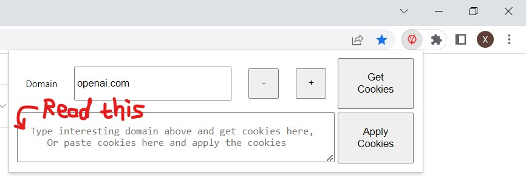
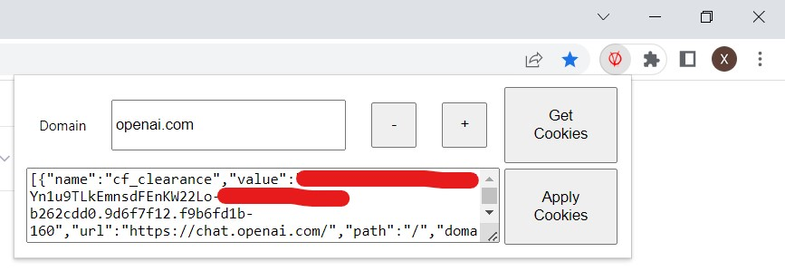

## impostor: A Google Chrome extension to impersonate others.
* I want my friend to use my ChatGPT account but I do not have a password (I use OAuth2) to share, so I made this extension to share my openai account's access tokens in the cookies.  
* Mechanism
  1. Get cookies that matches a specified domain (openai.com).
  2. Export the cookies as text.
  3. Import the cookies from text on another machine.
* Usage
  * Open the extension in my machine, where I have logged into my ChatGPT account. In the domain input box, past "openai.com" there. 
  </img>
  * Then click the button "Get Cookies" related to "openai.com"
  </img>
  * Email the Cookies to my friend.
  * Open the extension in his machine, copy and apply the "Cookies" then he can open https://chat.openai.com without login. 
## To-do list
* More filters: Should be about to match cookies by url, path, etc. 
